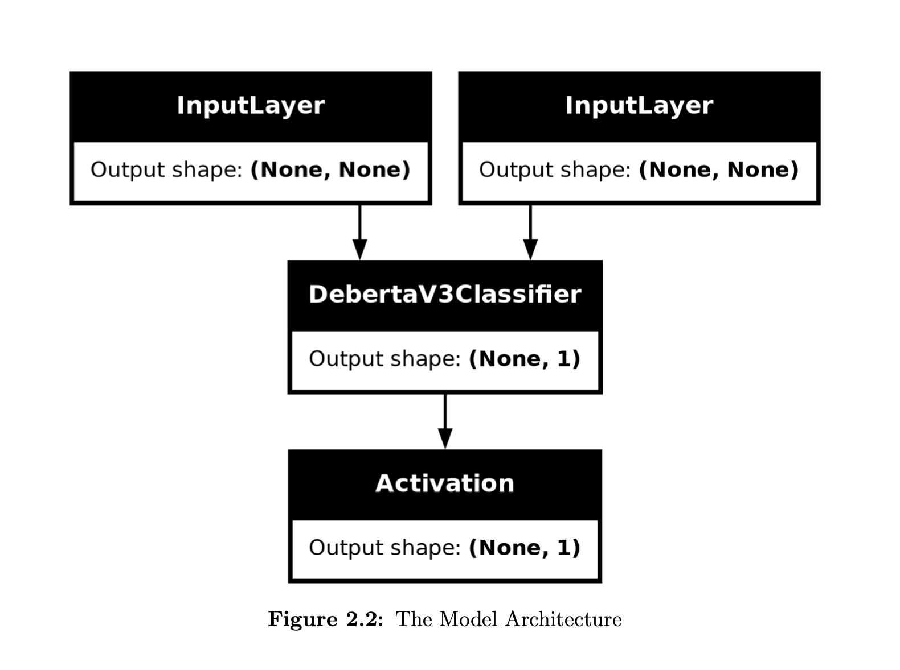
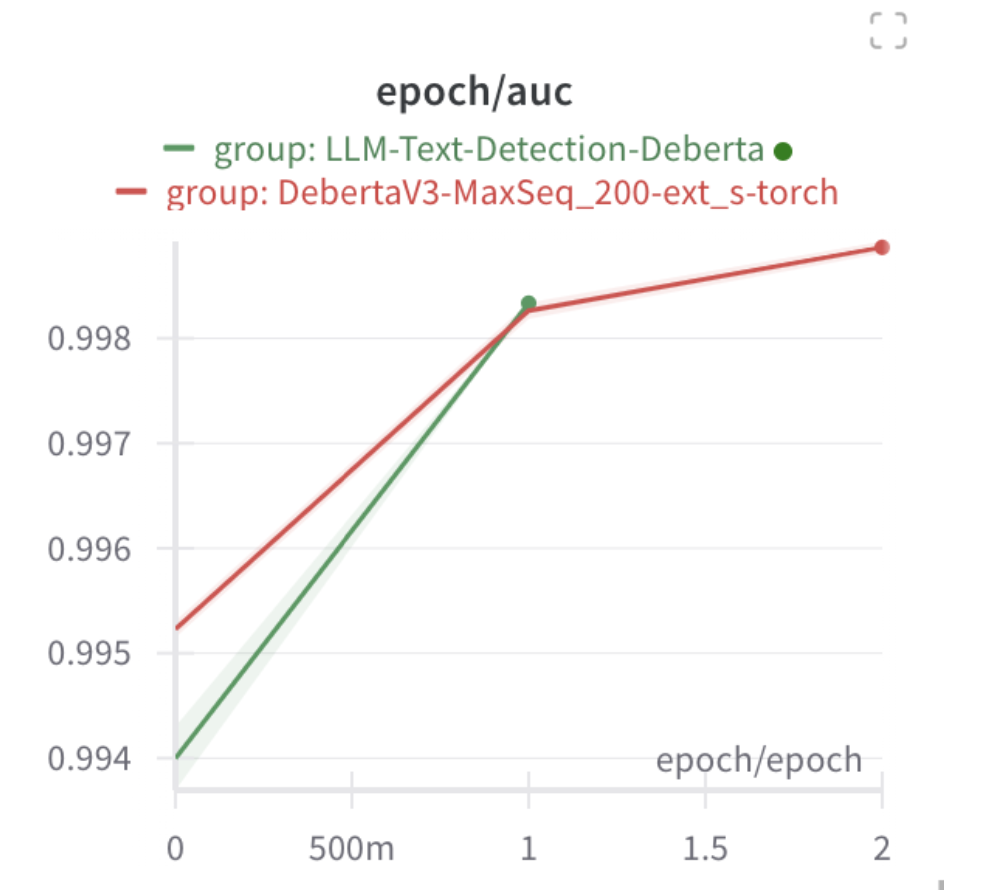

# LLM Detection

## Overview
LLM Detection is a machine learning-based project that aims to detect AI-generated text using the DeBERTaV3 model. The project addresses the challenge of distinguishing between human-written and AI-generated content, particularly in academic and online discourse.

## Team Members
- **Mobin Nesari**
- **Parmida Jabari**

### Supervisors:
- **Hadi Farahani**
- **Shide Sharif**
- **Niloofar Shabani**

## Dataset
### Description
The dataset consists of **1,378 essays**, labeled as either "real" or "fake" (AI-generated). The dataset includes the following columns:
- `id`: Unique identifier for each essay.
- `prompt_id`: The prompt used to generate the essay.
- `text`: The full content of the essay.
- `generated`: Binary label (1 for AI-generated, 0 for human-written).
- `label`: Target variable (1 = AI-generated, 0 = human-written).
- `name`: Categorical representation of the label.

### Addressing Class Imbalance
To improve model performance, two additional datasets were incorporated:
- **Proper Train Dataset** (10,000 AI-generated samples from various sources).
- **ArguGPT Dataset** (Enriched dataset with diverse AI-generated content).

## Model Architecture
We utilize **DeBERTaV3**, an advanced version of BERT, which improves language understanding through:
- **Disentangled attention**: Captures better contextual relationships between words.
- **Pre-trained embeddings**: Fine-tuned on AI-generated text.
- **Binary classification head**: Outputs the probability of text being AI-generated.

### Model Visualization
<p align="center">
  
</p>
<p align="center"><em>Figure 1: The architecture of the DeBERTaV3-based LLM detection model.</em></p>

### Training Setup
- **Loss function**: Binary Cross-Entropy with label smoothing (0.02)
- **Optimizer**: AdamW
- **Learning Rate Schedule**: Warm-up followed by cosine annealing

## Results & Evaluation
The model performance was assessed using:
- **AUC (Area Under the Curve)**: Measures ability to distinguish AI-generated vs. human-written text.
- **Cross-validation**: Evaluated across multiple folds for generalization.
- **External validation**: Tested on unseen datasets to ensure robustness.

### Sample Visualization
We monitored real-time training metrics using Weights & Biases.

<p align="center">
  
</p>
<p align="center"><em>Figure 2: The plot illustrates the model's classification performance, showcasing evaluation metrics such as AUC, accuracy, or loss trends over multiple training epochs.</em></p>

## Future Work
- Enhancing performance through **ensemble models**.
- Fine-tuning on **domain-specific AI-generated text**.
- Improving generalization for **low-resource languages**.

## Accessing the Code
Find the full implementation and dataset processing code in the repository:
[LLM Detection GitHub Repo](https://github.com/Parmidajabbari/LLM-Detection)

## Dependencies
To run the project, install the required dependencies:
```sh
pip install transformers datasets torch numpy pandas scikit-learn matplotlib wandb

## License
This project is licensed under the MIT License.


